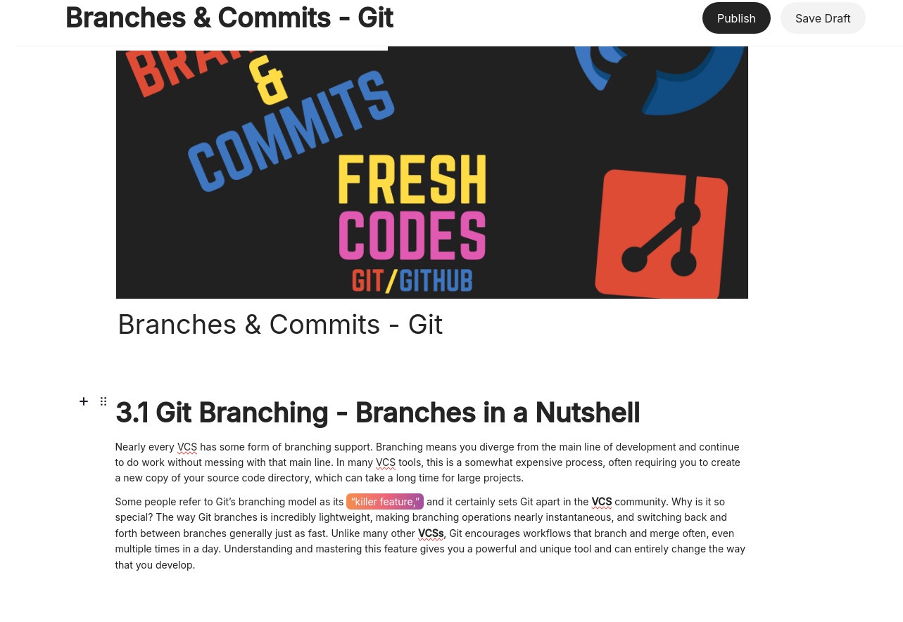
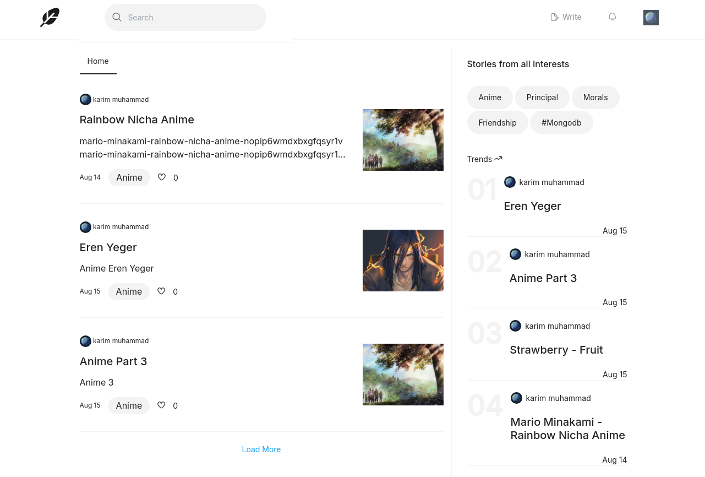
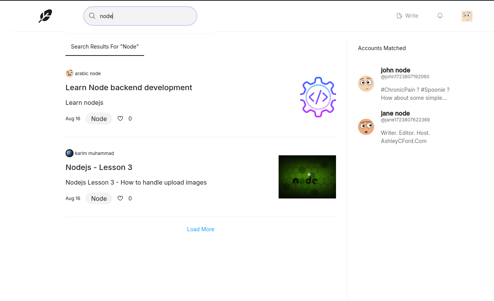
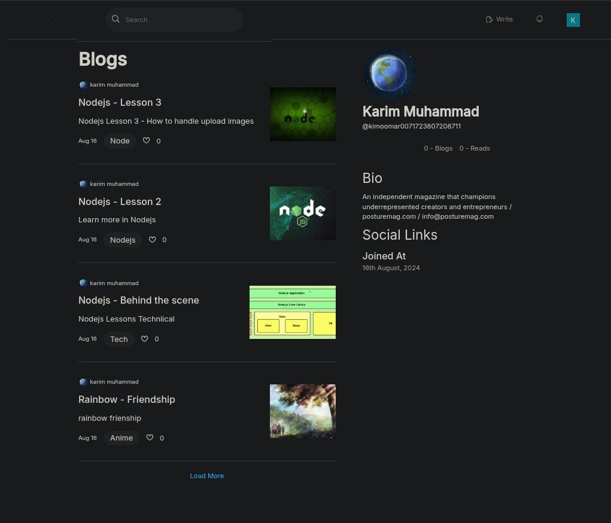
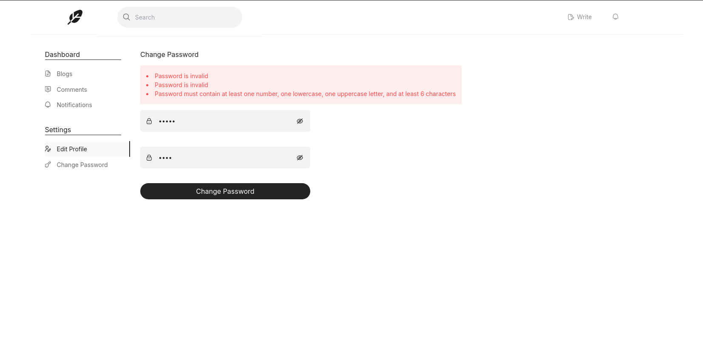
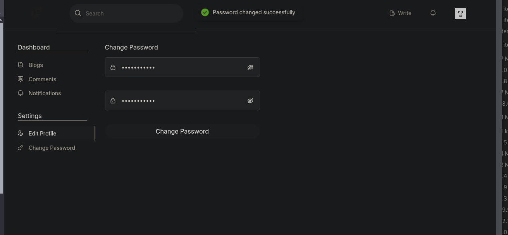
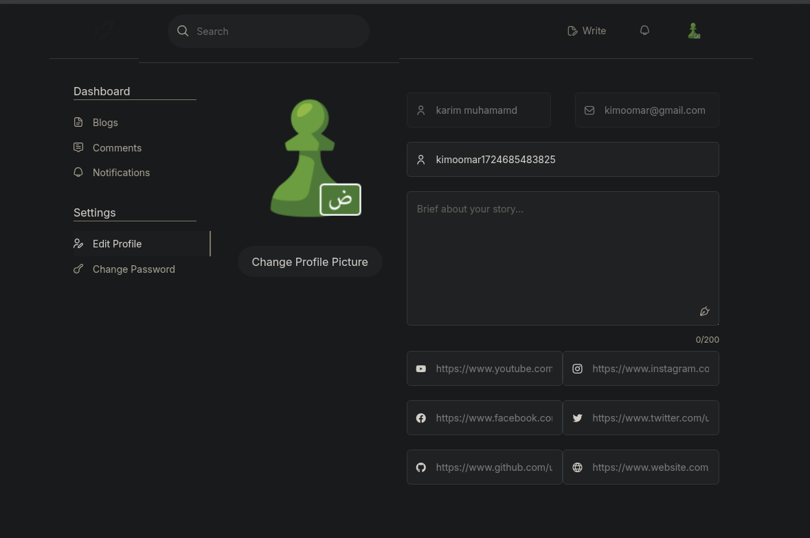
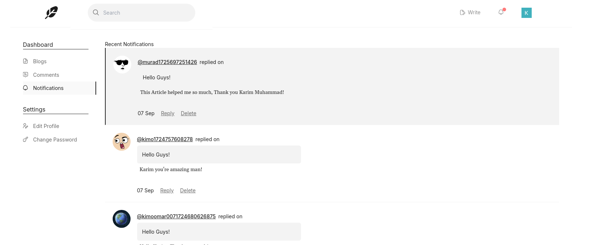
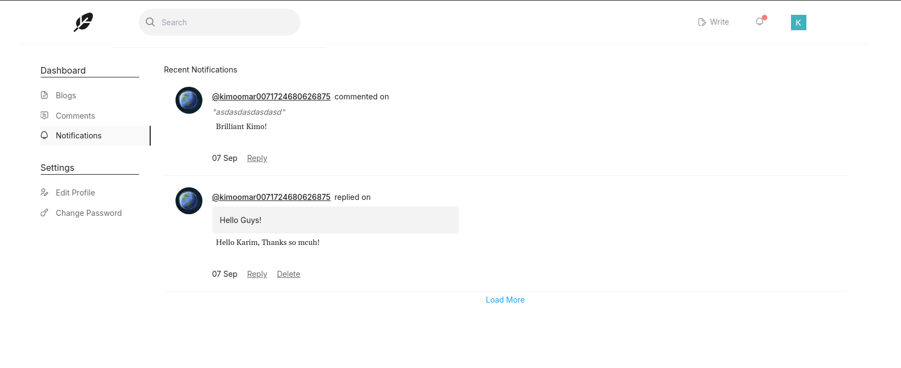
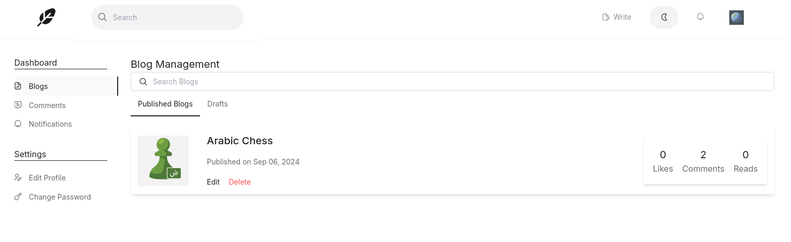

# Intensive Medium Blog clone with React

## Description

This project is a clone of the Medium blog website. It is a full-stack project that uses React for the front-end and Node.js for the back-end. The project is a single-page application that allows users to to many features e.g (read articles, create articles, and follow other users, etc...). The project uses a RESTful API to communicate between the front-end and back-end.

## Technologies

- React
- Tailwind CSS
- Node.js/Express
- MongoDB
- JWT
- AWS S3

## Features

- Dark/Light Mode
- User authentication (login, register, logout) + (Register / Login with Google)
- Authorization (only authenticated users can create articles)
- Create articles
  - Add images to articles (stored in AWS S3)
  - Rich text editor (using Editor.js) -
  - 
- Home page
- 
- Search Page (User & Articles)
- 
- Profile User (Follow, Unfollow, Edit Profile)
- 
- Article Page (Like [done], Comment[almost done], Bookmark[working])
- Comment on Article
- 
- 
- Edit Article
- 
- List of articles
- Settings / Dashboard
  - Change Password
  - 
  - 
  - Update Profile Image
  - 
- Notification Page (Reply, Seen, Unssen) + Pagination
- 
- 
- Blogs Management (Delete, Edit, View, Stats)
- 
- Pagination

## Some Refactors

1. Done Pagination for Comments and Show/Hide Replies [DONE]
2. Props Drilling converted to Context API or Redux [] (I will use Redux)

##### TODO

1. Replace returning whole replies for each comment with return as demand (lazy loading)
   1. when press 'load reply' button, then fetch replies from api (iam using eager loading now)
