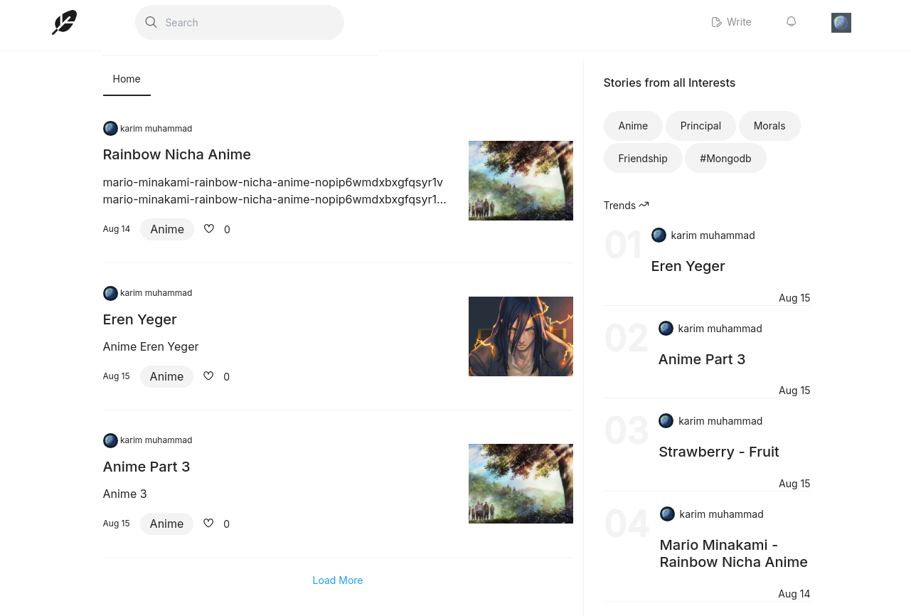
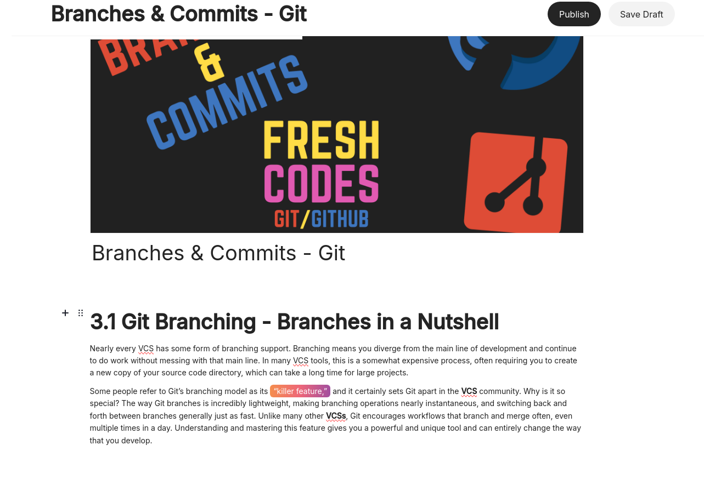
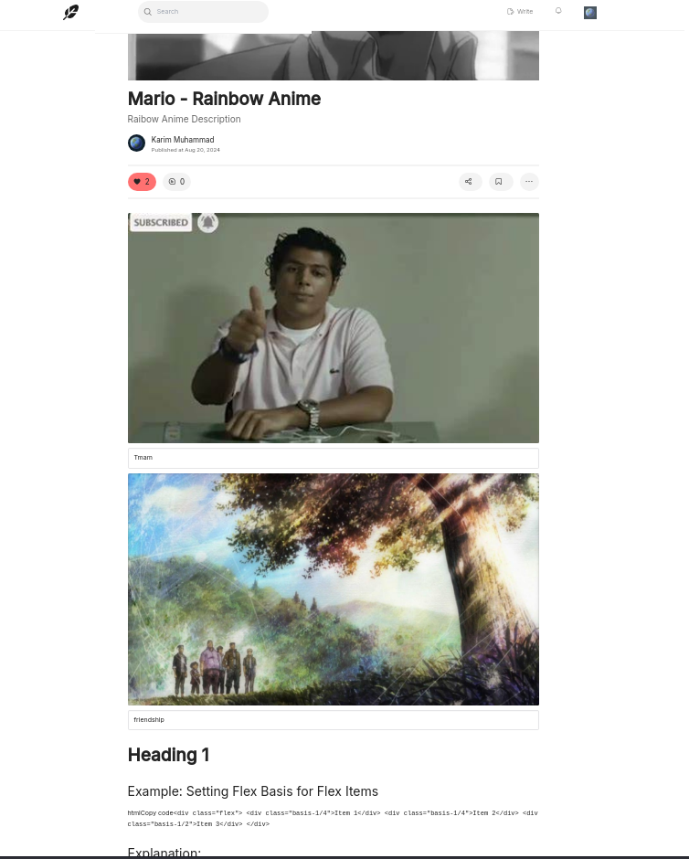
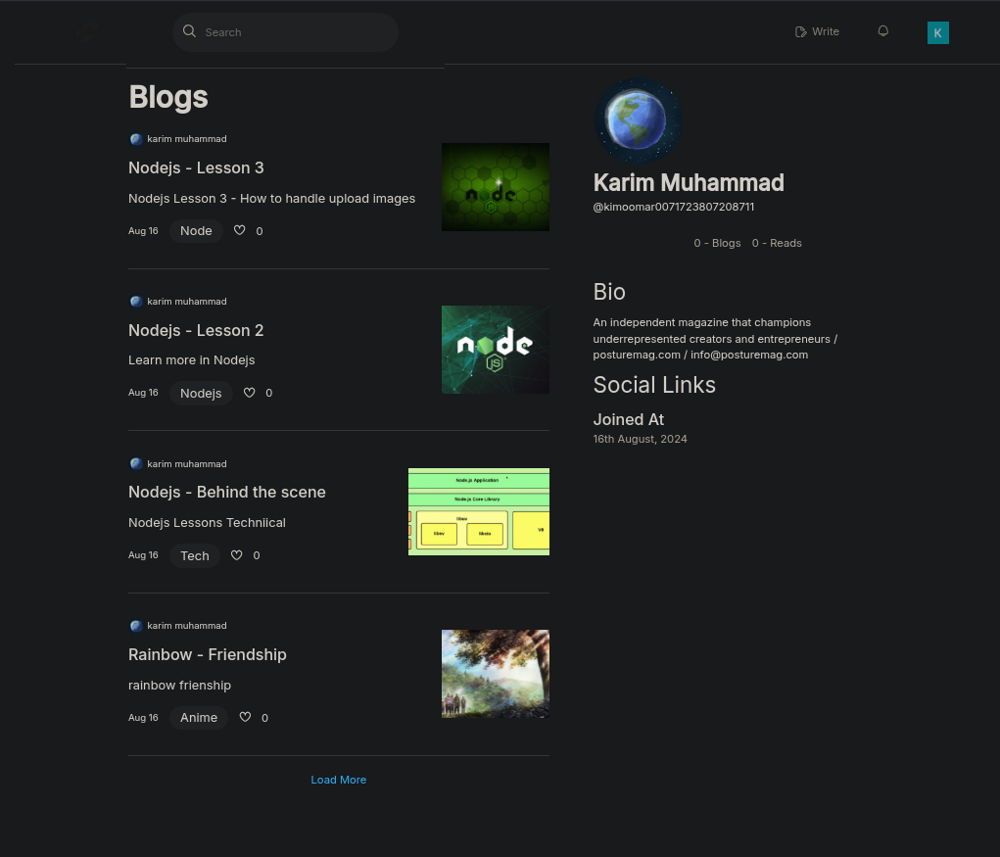
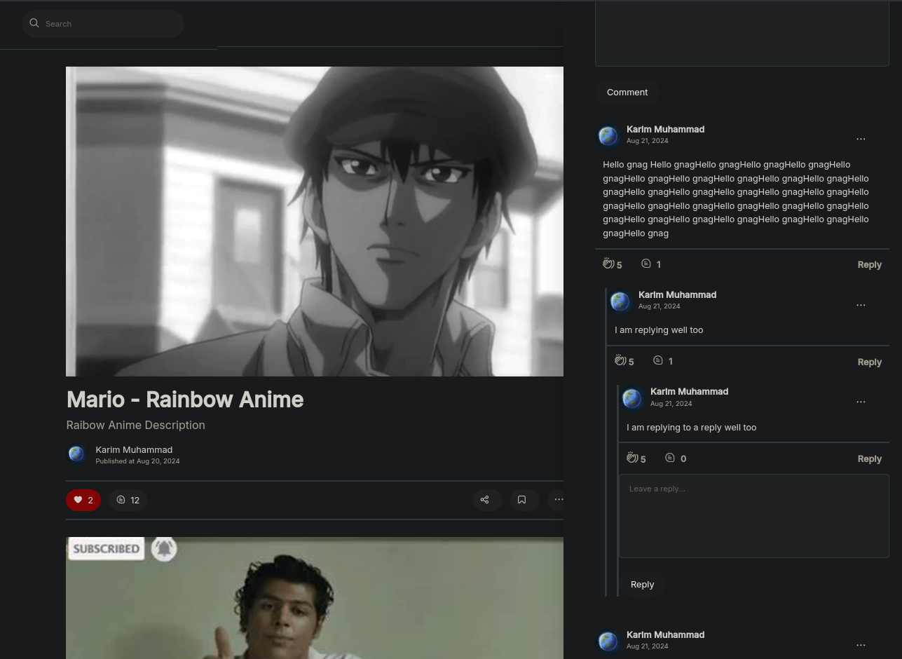
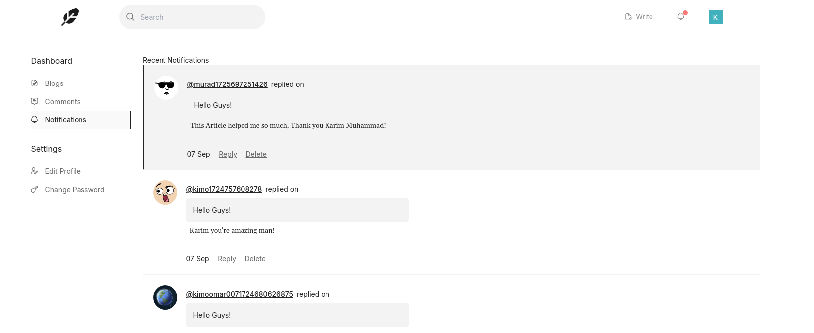

# Medium Lite

A responsive publishing client for writing, discovering, and discussing long-form articles. The React application connects to a REST API, uses Firebase for Google sign-in, and uploads article images through S3 presigned URLs.

[Live demo](https://mern-medium-blog.netlify.app/) · [Repository](https://github.com/KariMuhammad/medium-react)

## Highlights

- Email/password and Google authentication
- Rich article editing with Editor.js blocks, embeds, code, lists, quotes, and inline formatting
- Direct image uploads to AWS S3 through backend-generated presigned URLs
- Article discovery, trending content, tag filters, and user/article search
- Profiles with follow/unfollow actions and editable personal/social information
- Likes, comments, replies, and paginated notifications
- Draft and published-article management with edit, delete, and statistics views
- Responsive layouts, route guards, loading states, validation, and toast feedback

## Screenshots

| Home | Editor | Article |
| --- | --- | --- |
|  |  |  |

| Profile | Comments | Notifications |
| --- | --- | --- |
|  |  |  |

More UI captures are available in [`demo/`](demo/).

## Tech Stack

- React 18 and React Router
- Vite 4
- Tailwind CSS
- Axios
- Firebase Authentication
- Editor.js and `editorjs-react-renderer`
- React Hook Form and Yup
- Framer Motion

## Getting Started

### Prerequisites

- Node.js 18+
- npm
- A compatible Medium Lite API
- A Firebase web application with Google sign-in enabled

### Installation

```bash
git clone https://github.com/KariMuhammad/medium-react.git
cd medium-react
npm install
cp .env.example .env
```

Configure `.env`:

| Variable | Purpose |
| --- | --- |
| `VITE_SERVER_DOMAIN` | Base URL of the REST API, without a trailing slash |
| `VITE_API_KEY` | Firebase web API key |
| `VITE_AUTH_DOMAIN` | Firebase authentication domain |
| `VITE_PROJECT_ID` | Firebase project ID |
| `VITE_STORAGE_BUCKET` | Firebase storage bucket |
| `VITE_MESSAGING_SENDER_ID` | Firebase messaging sender ID |
| `VITE_APP_ID` | Firebase application ID |

Start the development server:

```bash
npm run dev
```

The Vite URL is printed in the terminal, normally `http://localhost:5173`.

## Available Scripts

| Command | Description |
| --- | --- |
| `npm run dev` | Start Vite in development mode |
| `npm run build` | Create a production build in `dist/` |
| `npm run preview` | Preview the production build locally |
| `npm run lint` | Run ESLint and fail on warnings |

## Application Structure

```text
src/
├── common/       # Firebase, sessions, dates, pagination, and shared helpers
├── components/   # Editor, article, comment, navigation, and dashboard UI
├── context/      # Authentication and article state providers
├── hooks/        # Reusable application actions
├── layouts/      # Public/authenticated layout shells
├── pages/        # Route-level screens
├── services/     # REST endpoint adapters and S3 upload flow
└── validations/  # Form schemas
```

API calls are grouped by domain in `src/services/`. The image-upload service first requests a presigned URL from `GET /get-s3-url`, uploads the file to that URL, and then stores the resulting public object URL with the article.

## Deployment

The repository contains [`netlify.toml`](netlify.toml) for SPA routing on Netlify. Add the same environment variables from `.env` to the deployment provider before building.

## Project Status

The main publishing, profile, interaction, management, and notification flows are implemented. Future improvements noted in the codebase include loading comment replies on demand and consolidating additional shared state.
