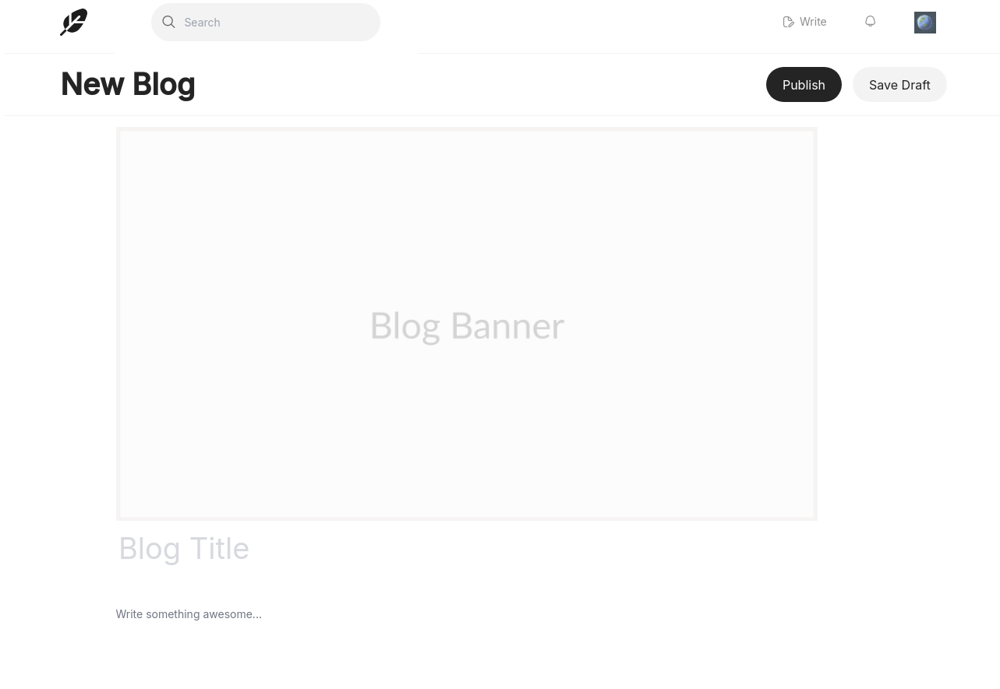

# Intensive Medium Blog clone with React

## Description

This project is a clone of the Medium blog website. It is a full-stack project that uses React for the front-end and Node.js for the back-end. The project is a single-page application that allows users to to many features e.g (read articles, create articles, and follow other users, etc...). The project uses a RESTful API to communicate between the front-end and back-end.

## Technologies

- React
- Tailwind CSS
- Node.js/Express
- MongoDB
- JWT
- AWS S3

## Features

- User authentication (login, register, logout) + (Register / Login with Google)
- Authorization (only authenticated users can create articles)
- Create articles
  - Add images to articles (stored in AWS S3)
  - Rich text editor (using Editor.js) -
  - 
- Home page
- 
- List of articles
- Pagination
